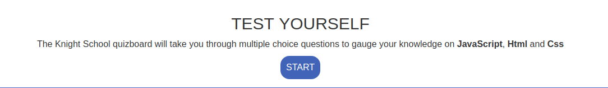
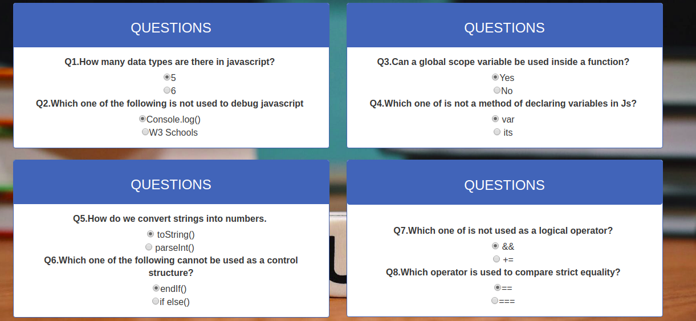
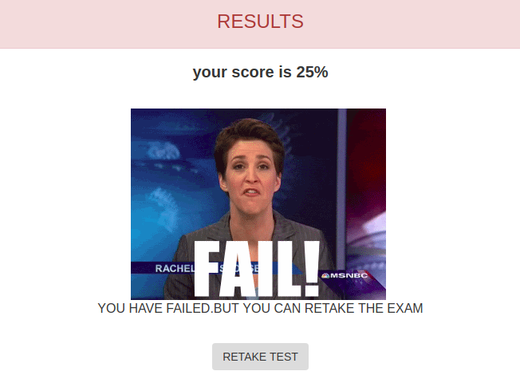

#   QUIZBOARD

## Project Definition
This is a simple website used to administer different tests to users to gauge their knowledge in HTML,CSS and JavaScript.

# AUTHOR'S INFORMATION
The project is written and coded by John Muasa Wathome, a junior web developer at Moringa School.

# SETUP INSTRUCTIONS
Once you load the program you go straight to the landing page where you will log in to continue.

You will now read the introductory statements and press **START**

You will now be required to fill out all provided questions.

On completion,you will click submit to view your test results.

You can retake the test if your results don't satisfy your expectations.

# BEHAVIOUR DRIVEN DEVELOPMENT
| GENERAL BEHAVIOUR | INPUT | OUTPUT|
|:------------------|:--------|:-----------|
|IF you score more than eighty percent| filled out questions| Congratulations|
|If you score 50 and above|filled out questions| This was a fair trial|
|if the user scores less than 50 |filled questions|This is not good.Try again

## TECHNOLOGIES USED
The main languages used were **HTML**,**CSS** and **JavaScript**

## CONTACT INFORMATION
By me some tea through my email address : <muasajohn01@gmail.com>
